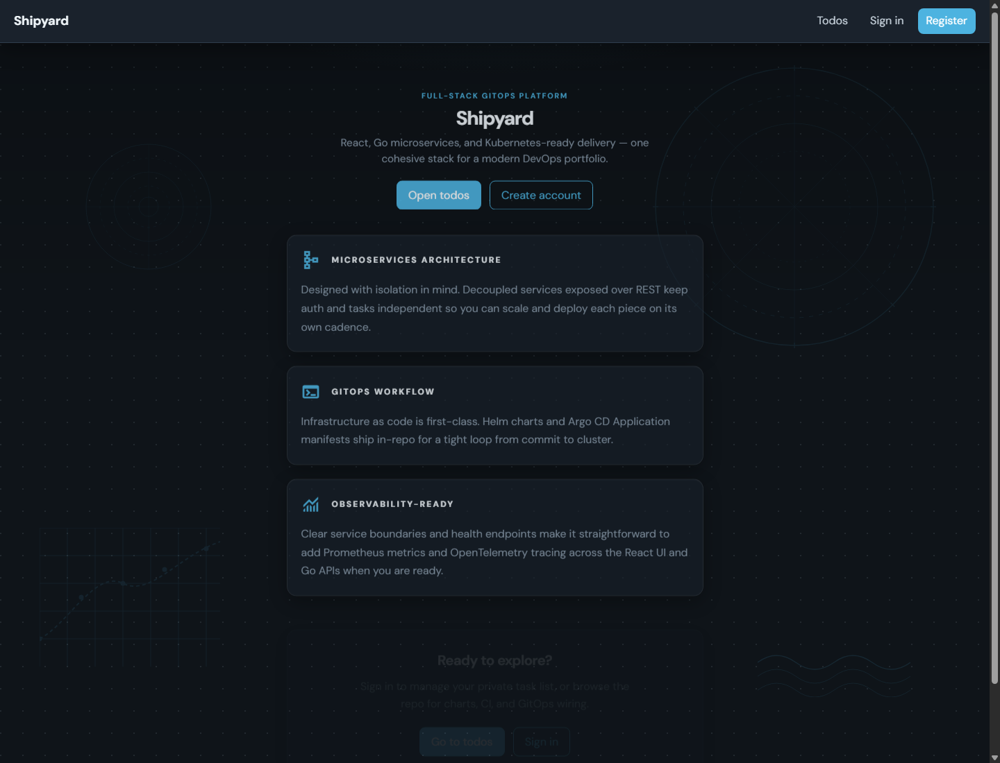
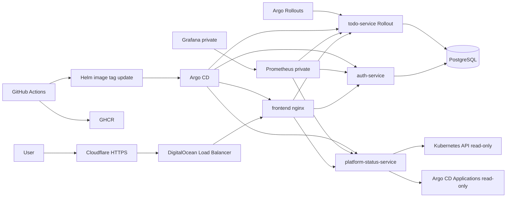

# Shipyard

Shipyard is a full-stack GitOps portfolio project built to demonstrate a
complete delivery chain — from source code to a running Kubernetes cluster —
using the tooling that shows up in real Platform and Backend Engineer roles.

The focus is on the delivery layer: GitOps with Argo CD, progressive delivery
with Argo Rollouts, path-filtered CI that commits Helm image tag bumps back to
Git, and a custom `platform-status-service` that reads its own cluster state
through scoped RBAC and surfaces a sanitized public snapshot. The application
itself (auth + todo CRUD in Go, React frontend) is intentionally simple so the
infrastructure and delivery story stays in the foreground.

**Stack:** React + Vite frontend, Go microservices, PostgreSQL, Docker,
Kubernetes, Helm, Argo CD, Argo Rollouts, GitHub Actions, GHCR.

[](https://github.com/SkyShineTH/Shipyard/actions/workflows/ci-todo.yml)
[](https://github.com/SkyShineTH/Shipyard/actions/workflows/ci-auth.yml)
[](https://github.com/SkyShineTH/Shipyard/actions/workflows/ci-frontend.yml)
[](https://github.com/SkyShineTH/Shipyard/actions/workflows/ci-platform-status.yml)

## Live Demo

> The cluster has been torn down to control cost. Evidence of the running
> environment — command output, screenshots, and a full walkthrough — is in
> [`docs/doks-live-demo.md`](docs/doks-live-demo.md). To spin it back up, see
> [Kubernetes Deployment](#kubernetes-deployment) below.



**What ran in production:**

- Runtime: DigitalOcean Kubernetes (Singapore), Argo CD, Argo Rollouts, Helm,
  PostgreSQL with a DigitalOcean Block Storage PVC, and a Load Balancer.
- TLS: Cloudflare proxy → DigitalOcean Load Balancer → nginx origin HTTPS via a
  Cloudflare Origin Certificate mounted as a Kubernetes TLS secret.
- Cost model: one shared-CPU worker node, one replica per service — intentionally
  minimal. See [docs/cost-control.md](docs/cost-control.md).
- Monitoring: private Prometheus/Grafana stack deployed on demand for evidence.
  See [docs/monitoring.md](docs/monitoring.md).

## Architecture

- `frontend`: React + Vite app served by nginx. In Kubernetes, nginx also
  reverse-proxies `/api/v1/*` to the backend services.
- `auth-service`: Go/Gin API for registration and login, backed by PostgreSQL
  and JWT signing.
- `todo-service`: Go/Gin API for authenticated todo CRUD operations. Deployed as
  an Argo Rollouts `Rollout`.
- `platform-status-service`: Go/Gin API that exposes a sanitized, read-only
  Kubernetes/GitOps snapshot for the public case-study page.
- `shipyard-monitoring`: on-demand Prometheus/Grafana stack for private
  observability evidence.
- `shipyard-observability`: ServiceMonitors and a custom Grafana dashboard for
  Shipyard metrics.
- `postgres`: PostgreSQL persistence.
- `gitops/charts/*`: Helm charts for all services.
- `gitops/argocd/*`: Argo CD Application manifests.
- `.github/workflows/*`: CI workflows that build images, push to GHCR, and bump
  Helm chart image tags.



## Stack

| Layer | Technology |
| --- | --- |
| Frontend | React 19, Vite 8, react-router-dom, nginx |
| Backend | Go, Gin, GORM |
| Database | PostgreSQL |
| Images | Docker multi-stage builds |
| Local runtime | Docker Compose, kind |
| Kubernetes | DigitalOcean Kubernetes for live demo |
| GitOps | Helm, Argo CD, Argo Rollouts |
| Registry | GHCR |

## Repository Structure

```text
services/
  auth-service/
  todo-service/
  platform-status-service/
  frontend/
gitops/
  charts/
    auth-service/
    todo-service/
    platform-status-service/
    frontend/
    shipyard-observability/
  argocd/
    argo-rollouts-app.yaml
    auth-app.yaml
    todo-app.yaml
    platform-status-app.yaml
    frontend-app.yaml
    monitoring-app.yaml
    shipyard-observability-app.yaml
.github/workflows/
docker-compose.yml
docs/
CONTEXT.md
```

## Services

### auth-service

- `GET /health`
- `GET /metrics`
- `POST /api/v1/register`
- `POST /api/v1/login`

### todo-service

All todo routes require `Authorization: Bearer <JWT>`.

- `GET /health`
- `GET /metrics`
- `GET /api/v1/todos`
- `POST /api/v1/todos`
- `PUT /api/v1/todos/:id`
- `DELETE /api/v1/todos/:id`

### frontend

- Local Compose: host `3000` to container `80`.
- Kubernetes: Service `shipyard-frontend`; nginx proxies API routes to
  `shipyard-auth-service`, `shipyard-todo-service`, and
  `shipyard-platform-status`.
- Public case-study page: `/case-study`.

### platform-status-service

- `GET /health`
- `GET /api/v1/platform/status`
- `GET /metrics`
- Uses read-only Kubernetes RBAC and returns sanitized public evidence only.
- Does not return secrets, kubeconfig, service account tokens, pod IPs, node
  names, database connection strings, or Argo CD credentials.

### Metrics

- `auth-service`, `todo-service`, and `platform-status-service` expose
  Prometheus metrics at `/metrics`.
- Grafana is private by default and should be opened with `kubectl port-forward`.
- Monitoring is optional and intended for on-demand portfolio evidence.

## Local Development

Copy `.env.example` to `.env`, then set real values for PostgreSQL and
`JWT_SECRET`.

```bash
docker compose up --build
```

Health checks:

```bash
curl http://127.0.0.1:8081/health
curl http://127.0.0.1:8080/health
curl -I http://127.0.0.1:3000/
```

Frontend-only development:

```bash
cd services/frontend
npm ci
npm run dev
```

## Kubernetes Deployment

Prerequisites:

- `kubectl`
- `helm`
- an Argo CD installation in namespace `argocd`
- the `shipyard` namespace
- PostgreSQL and service secrets

Install Argo Rollouts first because `todo-service` uses the `Rollout` CRD:

```bash
kubectl apply -f gitops/argocd/argo-rollouts-app.yaml
kubectl -n argocd wait --for=jsonpath='{.status.health.status}'=Healthy application/argo-rollouts --timeout=600s
kubectl apply -f gitops/argocd/
```

Check status:

```bash
kubectl -n argocd get applications.argoproj.io
kubectl -n shipyard get rollout,deploy,svc,pods,pvc
```

## Required Secrets

Both backend services read database settings and `JWT_SECRET` from Kubernetes
Secrets. Use the same `JWT_SECRET` for auth and todo.

```bash
kubectl -n shipyard create secret generic auth-service-secret \
  --from-literal=DB_HOST=postgres \
  --from-literal=DB_USER=shipyard \
  --from-literal=DB_PASSWORD=changeme \
  --from-literal=DB_NAME=shipyard \
  --from-literal=DB_PORT=5432 \
  --from-literal=DB_SSLMODE=disable \
  --from-literal=JWT_SECRET="replace-with-a-long-random-secret"

kubectl -n shipyard create secret generic todo-service-secret \
  --from-literal=DB_HOST=postgres \
  --from-literal=DB_USER=shipyard \
  --from-literal=DB_PASSWORD=changeme \
  --from-literal=DB_NAME=shipyard \
  --from-literal=DB_PORT=5432 \
  --from-literal=DB_SSLMODE=disable \
  --from-literal=JWT_SECRET="replace-with-a-long-random-secret"
```

## Origin TLS

The live demo uses Cloudflare in front of the DigitalOcean Load Balancer. The
frontend chart supports origin TLS by mounting a Kubernetes TLS secret into the
nginx container and exposing service port `443`.

Create or update the TLS secret from a Cloudflare Origin Certificate:

```powershell
kubectl -n shipyard create secret tls shipyard-origin-tls --cert=.secrets/shipyard-origin.pem --key=.secrets/shipyard-origin-key.pem --dry-run=client -o yaml | kubectl apply -f -
kubectl -n shipyard rollout restart deployment/shipyard-frontend
kubectl -n shipyard rollout status deployment/shipyard-frontend --timeout=300s
```

Do not commit `.secrets/` or any private key material.

## Argo Rollouts

`todo-service` uses Argo Rollouts for progressive delivery. The default rollout
steps are:

```text
20% -> pause for manual promotion -> 50% -> 100%
```

Common commands:

```bash
kubectl argo rollouts get rollout shipyard-todo-service -n shipyard --watch
kubectl argo rollouts promote shipyard-todo-service -n shipyard
kubectl argo rollouts undo shipyard-todo-service -n shipyard
```

If Argo CD reports `Suspended` for `shipyard-todo-service`, the rollout is
usually paused at the manual canary step, not broken.

## CI/CD

Each service has a path-filtered GitHub Actions workflow:

| Workflow | Scope |
| --- | --- |
| `ci-auth.yml` | `services/auth-service/**`, auth chart |
| `ci-todo.yml` | `services/todo-service/**`, todo chart |
| `ci-frontend.yml` | `services/frontend/**`, frontend chart |
| `ci-platform-status.yml` | `services/platform-status-service/**`, platform status chart |

The workflow builds a Docker image, pushes it to GHCR, updates the matching Helm
chart `image.tag`, and commits that GitOps change back to `main`.

## Troubleshooting

### Pods stuck in Pending with `Insufficient cpu`

The live demo is intentionally cost-conscious. On a small one-node cluster, keep
resource requests and replica counts low, or scale the node pool up temporarily.

### Frontend API proxy does not reach the backend

Check that the frontend chart `upstream.auth.host`, `upstream.todo.host`, and
`upstream.platform.host` match the Kubernetes Service names:

- `shipyard-auth-service`
- `shipyard-todo-service`
- `shipyard-platform-status`

### ImagePullBackOff

Confirm the rendered images and tags:

```bash
kubectl -n shipyard get deploy shipyard-auth-service -o jsonpath="{.spec.template.spec.containers[0].image}{'\n'}"
kubectl -n shipyard get rollout shipyard-todo-service -o jsonpath="{.spec.template.spec.containers[0].image}{'\n'}"
kubectl -n shipyard get deploy shipyard-platform-status -o jsonpath="{.spec.template.spec.containers[0].image}{'\n'}"
kubectl -n shipyard get deploy shipyard-frontend -o jsonpath="{.spec.template.spec.containers[0].image}{'\n'}"
```

### Hard-refresh Argo CD Applications

```bash
kubectl -n argocd annotate application shipyard-auth-service argocd.argoproj.io/refresh=hard --overwrite
kubectl -n argocd annotate application shipyard-todo-service argocd.argoproj.io/refresh=hard --overwrite
kubectl -n argocd annotate application shipyard-platform-status argocd.argoproj.io/refresh=hard --overwrite
kubectl -n argocd annotate application shipyard-frontend argocd.argoproj.io/refresh=hard --overwrite
```

## Conventions

- Kubernetes namespace: `shipyard`
- Argo CD app names: `shipyard-auth-service`, `shipyard-todo-service`,
  `shipyard-platform-status`, `shipyard-frontend`
- Images:
  `ghcr.io/skyshineth/shipyard-{auth-service,todo-service,platform-status-service,frontend}:<tag>`
- GitOps branch: `main`

See [CONTEXT.md](CONTEXT.md) for project context and
[docs/doks-live-demo.md](docs/doks-live-demo.md) for the live demo case study.
See [docs/monitoring.md](docs/monitoring.md) for the on-demand monitoring
workflow.
