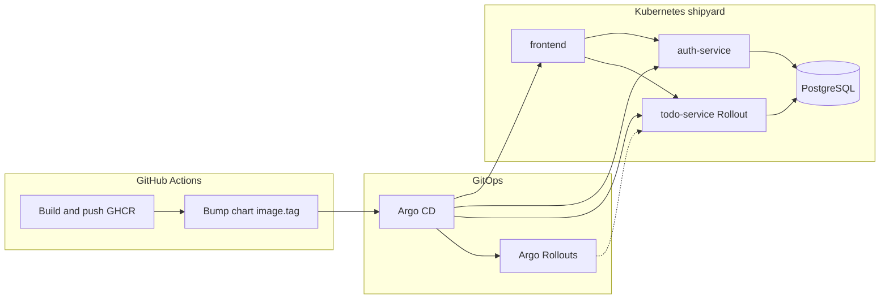

# Shipyard

A full-stack **GitOps** portfolio project: **React + Vite** frontend, **Go** microservices + **PostgreSQL**, deployed to Kubernetes with **Helm** and **ArgoCD**. CI builds images, pushes to **GHCR**, and bumps chart image tags for the GitOps loop. **`todo-service`** uses **Argo Rollouts** for canary-style progressive delivery (20% → manual promote → 50% → 100%).

[](https://github.com/SkyShineTH/Shipyard/actions/workflows/ci-todo.yml)
[](https://github.com/SkyShineTH/Shipyard/actions/workflows/ci-auth.yml)
[](https://github.com/SkyShineTH/Shipyard/actions/workflows/ci-frontend.yml)

## Live demo

**DigitalOcean Kubernetes (DOKS)** ถูก **destroy** แล้วเพื่อลดค่าใช้จ่ายหลังใช้เรียนรู้ — **ไม่มี URL สาธารณะของ full-stack app บน cloud ในตอนนี้**

- **รันเต็ม stack ในเครื่อง:** [Local development (Docker Compose)](#local-development-docker-compose) หรือ [Kubernetes (kind) + ArgoCD](#kubernetes-kind--argocd-gitops)
- **โปรเจกต์ / portfolio (static):** [skyshine.online](https://skyshine.online) — GitHub Pages (ไม่ใช่ cluster นี้)

ถ้าสร้าง DOKS ใหม่และติดตั้งตาม [DigitalOcean DOKS](#digitalocean-doks) ได้ **EXTERNAL-IP** จาก `kubectl -n shipyard get svc shipyard-frontend` แล้วใช้ `http://<EXTERNAL-IP>/` เป็น demo ชั่วคราวได้อีกครั้ง (HTTPS ต้องมีโดเมน + Ingress/cert-manager หรือ TLS บน LB ตามคู่มือ DO)

## Architecture (high level)

- **`todo-service`** (Go/Gin + GORM) — REST API for todos (JWT-protected); **Rollout** (canary) in Kubernetes
- **`auth-service`** (Go/Gin + JWT + bcrypt) — register / login
- **`frontend`** (React + Vite, nginx in production) — UI; nginx reverse-proxies `/api/v1/*` to the Go services
- **PostgreSQL** — persistence
- **Helm charts** — `gitops/charts/{todo-service,auth-service,frontend}`
- **ArgoCD Applications** — `gitops/argocd/*.yaml` (GitOps loop) + **`argo-rollouts`** controller
- **GitHub Actions** — `ci-todo.yml`, `ci-auth.yml`, `ci-frontend.yml`: build → push GHCR → update `image.tag` in chart `values.yaml`



## Repo structure

```text
services/
  todo-service/
  auth-service/
  frontend/                 # React app, nginx.conf (Compose), Dockerfile
gitops/
  charts/
    todo-service/
    auth-service/
    frontend/               # values.doks-public.yaml = LoadBalancer on DOKS; Deployment + Service + Ingress
  argocd/
    argo-rollouts-app.yaml  # Application: argo-rollouts (controller + CRDs)
    todo-app.yaml           # Application: shipyard-todo-service (Rollout)
    auth-app.yaml           # Application: shipyard-auth-service
    frontend-app.yaml       # Application: shipyard-frontend
.github/workflows/
docker-compose.yml
CONTEXT.md                  # extended project notes & timeline
```

## Stack (summary)

| Layer        | Technology                          |
| ------------ | ----------------------------------- |
| Frontend     | React 19, Vite 8, react-router-dom  |
| Backend      | Go, Gin, GORM                       |
| Database     | PostgreSQL 16                       |
| Images       | Docker (multi-stage)                |
| Cluster      | kind (local); DOKS เป็นทางเลือก — ดู [DOKS](#digitalocean-doks) (cluster สาธารณะเคยใช้แล้วถูก destroy) |
| GitOps       | Helm + ArgoCD + Argo Rollouts (todo canary) |
| Registry     | GHCR                                |

## Services & endpoints

### `todo-service` (default port **8080**)

- `GET /health`
- `GET /api/v1/todos` — requires `Authorization: Bearer <JWT>`
- `POST /api/v1/todos`
- `PUT /api/v1/todos/:id`
- `DELETE /api/v1/todos/:id`

### `auth-service` (default port **8081**)

- `GET /health`
- `POST /api/v1/register`
- `POST /api/v1/login`

### `frontend`

- **Docker Compose:** host port **3000** → container **80**; nginx proxies `/api/v1/*` to `auth-service:8081` and `todo-service:8080` on the Compose network.
- **Vite dev:** `npm run dev` (see `services/frontend`); API proxy is configured in `vite.config.js`.
- **Kubernetes:** chart mounts a **ConfigMap** with nginx config; set `upstream.*.host` in `gitops/charts/frontend/values.yaml` to match your backend **Service** names (defaults align with ArgoCD Application names: `shipyard-auth-service`, `shipyard-todo-service`).

## Local development (Docker Compose)

Copy and adjust env files (root `.env` from `.env.example`, etc.), then:

```bash
docker compose up --build
```

Set a non-empty **`JWT_SECRET`** in `.env` so todo and auth agree on token signing (Compose warns if it is missing).

Health checks:

```bash
curl http://127.0.0.1:8080/health
curl http://127.0.0.1:8081/health
curl -I http://127.0.0.1:3000/
```

Frontend-only (from `services/frontend`):

```bash
npm ci
npm run dev
```

## Kubernetes (kind) + ArgoCD (GitOps)

### Prereqs

- `kubectl`
- `kind`
- ArgoCD installed in the cluster (namespace: `argocd`)

### Deploy via ArgoCD Applications

Apply the Applications (adjust `repoURL` in the manifests if you fork). **Sync `argo-rollouts` before `shipyard-todo-service`** so the `Rollout` CRD exists (or let Argo retry the todo app after the controller is healthy).

```bash
kubectl apply -f gitops/argocd/argo-rollouts-app.yaml
kubectl -n argocd wait --for=jsonpath='{.status.health.status}'=Healthy application/argo-rollouts --timeout=300s
kubectl apply -f gitops/argocd/
```

Then watch:

```bash
kubectl -n argocd get applications.argoproj.io
kubectl -n shipyard get rollout,deploy,svc,pods
```

### Argo Rollouts (todo-service canary)

`gitops/charts/todo-service` deploys a **Rollout** (not a Deployment) with steps: **20% → pause (manual promote) → 50% → 100%**. Without a service mesh, weights are approximated via replica counts; the chart defaults to **2** replicas so a **single small node** (e.g. one DOKS worker) can still schedule todo + frontend + auth. Increase `replicaCount` in `values.yaml` on larger clusters if you want a finer canary split.

Install the [kubectl argo rollouts plugin](https://argo-rollouts.readthedocs.io/en/stable/features/kubectl-plugin/), then after a new image tag syncs:

```bash
kubectl argo rollouts get rollout shipyard-todo-service -n shipyard --watch
kubectl argo rollouts promote shipyard-todo-service -n shipyard
```

Use `kubectl argo rollouts undo shipyard-todo-service -n shipyard` if you need to abort.

### Required secrets (namespace `shipyard`)

Todo and auth charts load DB (and todo loads JWT) via `envFrom.secretRef`. **Use the same `JWT_SECRET` for both** `auth-service-secret` and `todo-service-secret`.

```bash
kubectl -n shipyard create secret generic todo-service-secret \
  --from-literal=DB_HOST=postgres \
  --from-literal=DB_USER=shipyard \
  --from-literal=DB_PASSWORD=changeme \
  --from-literal=DB_NAME=shipyard \
  --from-literal=DB_PORT=5432 \
  --from-literal=DB_SSLMODE=disable \
  --from-literal=JWT_SECRET="replace-with-a-long-random-secret"

kubectl -n shipyard create secret generic auth-service-secret \
  --from-literal=DB_HOST=postgres \
  --from-literal=DB_USER=shipyard \
  --from-literal=DB_PASSWORD=changeme \
  --from-literal=DB_NAME=shipyard \
  --from-literal=DB_PORT=5432 \
  --from-literal=DB_SSLMODE=disable \
  --from-literal=JWT_SECRET="replace-with-a-long-random-secret"
```

### Test on the cluster (port-forward)

```bash
kubectl -n shipyard port-forward svc/shipyard-frontend 3000:80
kubectl -n shipyard port-forward svc/shipyard-auth-service 8081:8081
kubectl -n shipyard port-forward svc/shipyard-todo-service 8080:8080
```

Then open `http://127.0.0.1:3000` or hit the APIs directly, for example:

```bash
curl http://127.0.0.1:8081/health
curl http://127.0.0.1:8080/health
```

## DigitalOcean DOKS

ส่วนนี้เป็นคู่มือติดตั้งบน **DigitalOcean Kubernetes** เมื่อมี cluster ใหม่ — **cluster เดิมที่เคยใช้ demo ถูก destroy แล้ว** จึงไม่มี live URL จาก DO ใน README

ใช้ขั้นตอนด้านล่างเมื่อมี DOKS และ `kubectl` / `doctl kubeconfig save` ใช้งานได้แล้ว

### 1. ติดตั้ง Argo CD

```bash
kubectl create namespace argocd
kubectl apply -n argocd -f https://raw.githubusercontent.com/argoproj/argo-cd/stable/manifests/install.yaml
kubectl -n argocd rollout status deploy/argocd-server --timeout=300s
```

รหัสผ่าน admin เริ่มต้น (user **`admin`**):

```bash
kubectl -n argocd get secret argocd-initial-admin-secret -o jsonpath="{.data.password}" | base64 -d
```

บน **PowerShell**:

```powershell
[Text.Encoding]::UTF8.GetString([Convert]::FromBase64String((kubectl -n argocd get secret argocd-initial-admin-secret -o jsonpath='{.data.password}')))
```

เข้า UI แบบเร็ว: port-forward

```bash
kubectl -n argocd port-forward svc/argocd-server 8080:443
```

แล้วเปิด `https://127.0.0.1:8080` (ยอมรับ self-signed cert)

**หรือ** ให้ DO สร้าง Load Balancer สำหรับ UI:

```bash
kubectl patch svc argocd-server -n argocd -p '{"spec":{"type":"LoadBalancer"}}'
kubectl -n argocd get svc argocd-server
```

รอจนได้ **EXTERNAL-IP** แล้วเข้า `https://<EXTERNAL-IP>` (Argo CD ใช้ TLS บน server อยู่แล้ว)

### 2. Namespace และ PostgreSQL

สร้าง namespace สำหรับแอปและฐานข้อมูล:

```bash
kubectl create namespace shipyard
```

**ตัวเลือก A — PostgreSQL ใน cluster (เหมาะกับ demo):** ใช้ Helm + Bitnami แล้วตั้งชื่อ Service เป็น `postgres` ให้ตรงกับตัวอย่าง secret ด้านล่าง

```bash
helm repo add bitnami https://charts.bitnami.com/bitnami
helm repo update
helm install postgres bitnami/postgresql -n shipyard \
  --set fullnameOverride=postgres \
  --set auth.username=shipyard \
  --set auth.password='changeme' \
  --set auth.database=shipyard
```

รอจน `kubectl -n shipyard get pods` แสดง Postgres **Running** ก่อนสร้าง secret และ sync แอป

**ตัวเลือก B — DO Managed Database:** สร้าง Postgres ในเมนู **Databases** แล้วใส่ `DB_HOST` / `DB_PORT` / `DB_SSLMODE=require` (และ user/password/db name) ใน secret ให้ตรงค่าที่ DO ให้

### 3. Secrets (`shipyard`) และ GHCR (ถ้า image เป็น private)

สร้าง secret แอป (แก้รหัสผ่านและ `JWT_SECRET`):

```bash
kubectl -n shipyard create secret generic todo-service-secret \
  --from-literal=DB_HOST=postgres \
  --from-literal=DB_USER=shipyard \
  --from-literal=DB_PASSWORD=changeme \
  --from-literal=DB_NAME=shipyard \
  --from-literal=DB_PORT=5432 \
  --from-literal=DB_SSLMODE=disable \
  --from-literal=JWT_SECRET="replace-with-a-long-random-secret"

kubectl -n shipyard create secret generic auth-service-secret \
  --from-literal=DB_HOST=postgres \
  --from-literal=DB_USER=shipyard \
  --from-literal=DB_PASSWORD=changeme \
  --from-literal=DB_NAME=shipyard \
  --from-literal=DB_PORT=5432 \
  --from-literal=DB_SSLMODE=disable \
  --from-literal=JWT_SECRET="replace-with-a-long-random-secret"
```

ถ้า GHCR **private** ให้สร้าง pull secret (ใช้ GitHub username + PAT ที่มี `read:packages`):

```bash
kubectl -n shipyard create secret docker-registry ghcr-pull \
  --docker-server=ghcr.io \
  --docker-username=YOUR_GITHUB_USER \
  --docker-password=YOUR_GITHUB_PAT \
  --docker-email=you@example.com
```

จากนั้นใน `gitops/charts/{todo-service,auth-service,frontend}/values.yaml` ตั้ง `imagePullSecrets: [{ name: ghcr-pull }]` (หรือ override ผ่าน Argo CD UI → Parameters) แล้ว commit — หรือใช้ **public** package บน GHCR เพื่อไม่ต้องมี secret

### 4. ลง GitOps apps (ลำดับสำคัญ)

จากราก repo (หรือ path ที่มี `gitops/argocd/`):

```bash
kubectl apply -f gitops/argocd/argo-rollouts-app.yaml
kubectl -n argocd wait --for=jsonpath='{.status.health.status}'=Healthy application/argo-rollouts --timeout=600s
kubectl apply -f gitops/argocd/
```

ตรวจสอบ:

```bash
kubectl -n argocd get applications.argoproj.io
kubectl -n shipyard get rollout,deploy,svc,pods
```

ถ้าแอปติด **OutOfSync / Unknown** ให้เปิด Argo CD UI → Sync หรือ hard refresh ตาม [Troubleshooting](#argocd-shows-unknown)

### 5. URL สาธารณะ (DOKS)

แอป **`shipyard-frontend`** ใช้ Helm `valueFiles` รวม **`values.doks-public.yaml`** ซึ่งตั้ง `service.type: LoadBalancer` — หลัง Argo CD sync แล้ว DigitalOcean จะสร้าง **Load Balancer** และได้ **EXTERNAL-IP**

```bash
kubectl -n shipyard get svc shipyard-frontend
```

รอจน **`EXTERNAL-IP`** ไม่เป็น `<pending>` แล้วเปิดเบราว์เซอร์:

- **`http://<EXTERNAL-IP>/`** — นี่คือ public URL ของ Shipyard (HTTP) **ไม่ต้องมีโดเมน** ใช้แค่ IP ก็เข้าได้

ถ้ามี **โดเมน** (ไม่บังคับ): สร้าง DNS **A record** ชี้ไปที่ IP นั้น แล้วใช้ `http://ชื่อโดเมน/` — ถ้าไม่มีโดเมน ข้ามขั้นนี้ได้เลย

**HTTPS:** ต้องมี **โดเมน** (Let’s Encrypt ไม่ออก cert ให้ “แค่ IP” แบบทั่วไป) จากนั้นติด **Ingress Controller** + **cert-manager** แล้วเปิด `ingress.enabled` / TLS ใน chart ตามคู่มือ [DO + Ingress](https://docs.digitalocean.com/products/kubernetes/how-to/configure-load-balancers/) / [nginx ingress](https://kubernetes.github.io/ingress-nginx/deploy/#digital-ocean) — ใช้เวลาตั้งค่ามากกว่า **LoadBalancer + HTTP** พอสมควร; ถ้ายังไม่จำเป็นให้ใช้ demo แบบ HTTP ด้านบนก่อน

**บน kind (local):** `EXTERNAL-IP` อาจค้าง `pending` โดยไม่มี MetalLB — ยังใช้ **`kubectl -n shipyard port-forward svc/shipyard-frontend 3000:80`** ได้ตามเดิม

### DOKS: Pod ค้าง `Pending` / Argo CD `Degraded` — `Insufficient cpu`

ถ้า `kubectl describe pod ...` ใน Events มี **`Insufficient cpu`**: node เดียวไม่พอรับ **หลาย replica** (เดิม todo ตั้ง 5 ตัว + frontend + auth + Postgres + Argo CD)

- แก้ใน repo: ลด `replicaCount` ใน `gitops/charts/todo-service/values.yaml` (ค่าเริ่มต้นปัจจุบันตั้งให้เหมาะกับ cluster เล็กแล้ว) แล้ว push ให้ GitOps sync  
- หรือเพิ่มขนาด/จำนวน node ใน DOKS

## CI/CD (GitHub Actions)

On pushes to **`main`** (path-filtered per service), workflows:

- build the Docker image for that service
- push to **GHCR** (`ghcr.io/<owner>/shipyard-<service>`)
- commit an update to `gitops/charts/<service>/values.yaml` (`image.tag`, `[skip ci]`)

ArgoCD picks up the Git change and syncs the cluster.

| Workflow        | Paths (among others)                          |
| --------------- | ---------------------------------------------- |
| `ci-todo.yml`   | `services/todo-service/**`, chart todo         |
| `ci-auth.yml`   | `services/auth-service/**`, chart auth         |
| `ci-frontend.yml` | `services/frontend/**`, chart frontend       |

## Troubleshooting

### `ImagePullBackOff` / `ErrImagePull`

- Image name/tag wrong or tag not yet in GHCR; confirm the Deployment image:

```bash
kubectl -n shipyard get deploy shipyard-auth-service -o jsonpath="{.spec.template.spec.containers[0].image}{'\n'}"
kubectl -n shipyard get rollout shipyard-todo-service -o jsonpath="{.spec.template.spec.containers[0].image}{'\n'}"
kubectl -n shipyard get deploy shipyard-frontend -o jsonpath="{.spec.template.spec.containers[0].image}{'\n'}"
```

### `CreateContainerConfigError`

- Often missing secrets or volume/security context issues:

```bash
kubectl -n shipyard describe pod <pod-name>
```

### Frontend API proxy fails in Kubernetes

- Ensure `gitops/charts/frontend/values.yaml` → `upstream.auth.host` / `upstream.todo.host` match the **Service** names of auth and todo in `shipyard` (defaults: `shipyard-auth-service`, `shipyard-todo-service`).

### Frontend `CrashLoopBackOff` — nginx `chown` / `setgid(101) Operation not permitted`

Official nginx drops to user `101` in workers; with `capabilities.drop: ALL` add **`NET_BIND_SERVICE`**, **`CHOWN`**, **`SETUID`**, **`SETGID`**. The chart `values.yaml` includes these — sync the latest `shipyard-frontend` Application.

### DOKS: รีเซ็ตเฉพาะแอปใน `shipyard` (ข้อมูล Postgres หาย)

ถ้าอยากเริ่มติดตั้งแอปใหม่โดยไม่ลบ Argo CD:

```bash
kubectl delete namespace shipyard
kubectl create namespace shipyard
# ติดตั้ง Postgres + secrets ตามหัวข้อ DigitalOcean DOKS แล้ว apply gitops/argocd/ อีกครั้ง (หรือ Sync ใน Argo CD)
```

ถ้าจะลบทั้ง Argo CD ด้วย: `kubectl delete namespace argocd` แล้วติดตั้ง Argo CD + Rollouts + Applications ตาม README

### Argo CD: `shipyard-todo-service` shows **Suspended**

Often the **Rollout** is paused on a **canary step** (`CanaryPauseStep`), not “sync suspended.” Check: `kubectl -n shipyard get rollout shipyard-todo-service -o jsonpath='{.status.pauseConditions}'`. Continue with [kubectl argo rollouts plugin](https://argo-rollouts.readthedocs.io/en/stable/features/kubectl-plugin/): `kubectl argo rollouts promote shipyard-todo-service -n shipyard`.

### ArgoCD shows `Unknown`

- Hard refresh:

```bash
kubectl -n argocd annotate application shipyard-auth-service argocd.argoproj.io/refresh=hard --overwrite
kubectl -n argocd annotate application shipyard-todo-service argocd.argoproj.io/refresh=hard --overwrite
kubectl -n argocd annotate application shipyard-frontend argocd.argoproj.io/refresh=hard --overwrite
```

## Conventions (short)

- **K8s namespace:** `shipyard`
- **ArgoCD app names:** `shipyard-todo-service`, `shipyard-auth-service`, `shipyard-frontend`
- **Images:** `ghcr.io/<github-username-lowercase>/shipyard-{todo-service,auth-service,frontend}:<tag>`
- **GitOps branch:** `main`

See [CONTEXT.md](./CONTEXT.md) for timeline, conventions, and detailed notes.
